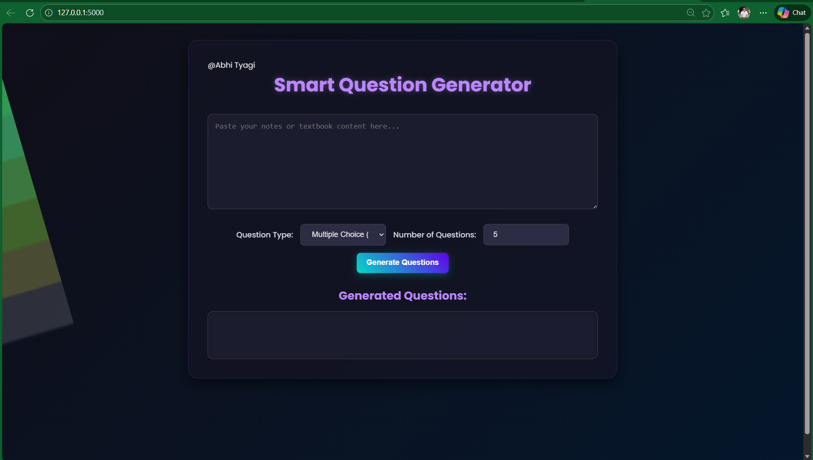
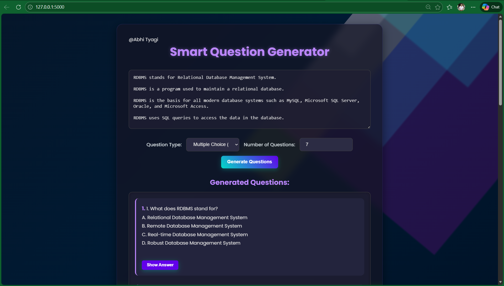
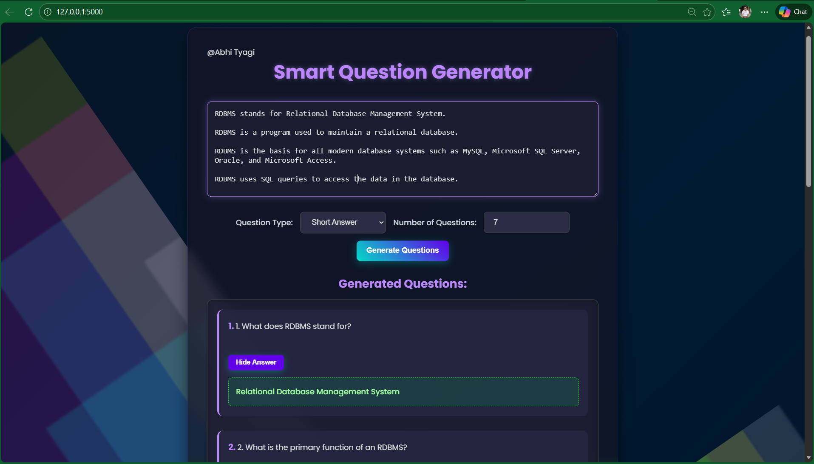

# Smart Question Generator

Generate MCQs and Short Answer questions from study notes or any given text using AI.

## Features
- Paste notes or textbook content
- Generate Multiple Choice Questions (MCQs) with options and correct answers
- Generate Short Answer Questions
- Simple, clean user interface

## Tech Stack
- Frontend: HTML, CSS, JavaScript
- Backend: Python, Flask
- AI: Google Gemini API (gemini-flash-lite-latest)
- Environment management: python-dotenv

## How to Run Locally
1. Clone the repo
2. Create virtual environment:
   ```bash
   python -m venv venv
   venv\Scripts\activate

   # SCREENSHOTS

   #Home page 
   

   #Multiple choice questions
   

   #Short answer question
   
